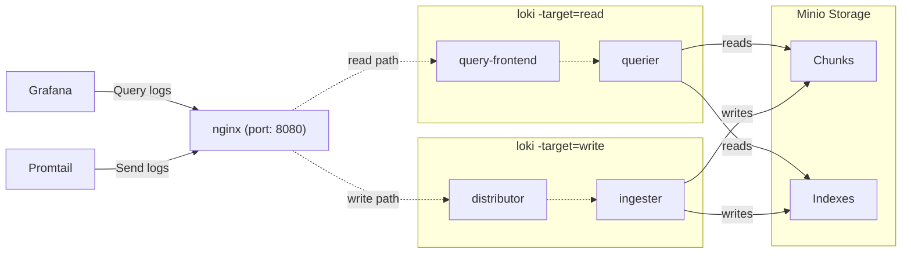

# Grafana-stack

Repo for using the Grafana stack for complete observability on a system

# Stack with docker-compose

You can use this `docker-compose` setup to run Docker for development or in production.

## Features

- Running in [Simple Scalable Deployment](https://grafana.com/docs/loki/latest/fundamentals/architecture/deployment-modes/#simple-scalable-deployment-mode) mode with 3 replicas for `read` and `write` targets
- Memberlist for [consistent hash](https://grafana.com/docs/loki/latest/fundamentals/architecture/rings/) ring
- [Minio](https://min.io/) for S3-compatible storage for chunks & indexes
- nginx gateway which acts as a reverse-proxy to the read/write paths
- Promtail for logs
  - An optional log-generator
- Multi-tenancy enabled (`docker` as the tenant ID)
- Configuration for interactive debugging (see [Debugging](#debugging) section below)
- Prometheus for metric collection

## Diagram

The below diagram describes the various components of this deployment, and how data flows between them.



## Getting Started

Simply run `docker-compose up` and all the components will start.

It'll take a few seconds for all the components to start up and register in the [ring](http://localhost:8080/ring). Once all instances are `ACTIVE`, Loki will start accepting reads and writes. All logs will be stored with the tenant ID `docker`.

All data will be stored in the `.data` directory.

The nginx gateway runs on port `8080` and you can access Loki through it.

## Endpoints

- [prometheus](http://localhost:9090)
- [node_exporter](http://localhost:9100)
- [pushgateway](http://localhost:9091)
- [grafana](http://localhost:3000)
- [promtail](http://localhost:9080)
- [alertmanager](http://localhost:9093)
- Loki:
  - [`/ring`](http://localhost:8080/ring) - view all components registered in the hash ring
  - [`/config`](http://localhost:8080/config) - view the configuration used by Loki
  - [`/memberlist`](http://localhost:8080/memberlist) - view all components in the memberlist cluster
  - [all other Loki API endpoints](https://grafana.com/docs/loki/latest/api/)

## Debugging

To debug and enter a container, add:

```sh
stdin_open: true
tty: true
```

You'll need to build a Loki image that includes and runs [delve](https://github.com/go-delve/delve).

Run `make loki-debug-image` from the root of this project. Grab the image name from the output (it'll look like `grafana/loki:...-debug`) and replace the Loki images in `docker-compose.yaml`.

Next, view the `docker-compose.yaml` file and uncomment the sections related to debugging.

You can follow [this guide](https://blog.jetbrains.com/go/2020/05/06/debugging-a-go-application-inside-a-docker-container/) to enable debugging in GoLand, but the basic steps are:

1. Bind a host port to one of the Loki services
2. Add a _Go Remote_ debug configuration in GoLand and use that port
3. Run `docker-compose up`
4. Set a breakpoint and start the debug configuration
5. Build/debug something awesome :)

## TO_DO

1. Add log discovery based on these labels:

```sh
org.label-schema.logging_agent: "promtail"
org.label-schema.logging_jobname: "container_logs"
```

Following this [label schema](http://label-schema.org/rc1/)

2. Create dashboards for Loki
3. Add tempo for tracing
4. Update diagram for docker-compose
5. Add example for deploying in Kubernetes
